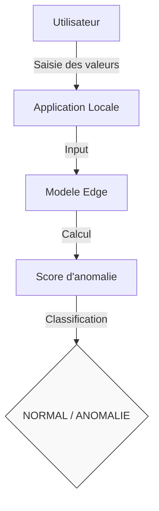
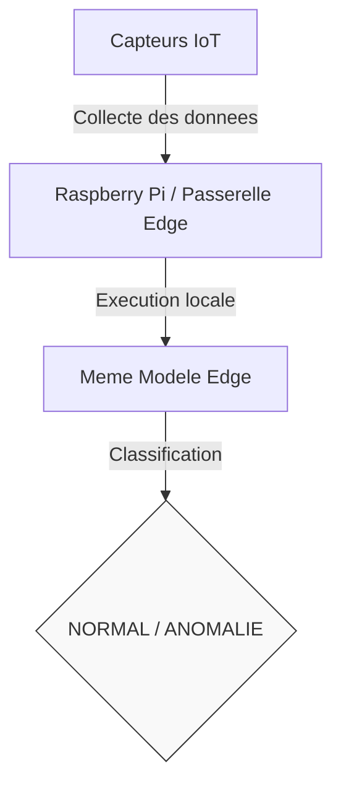

# Détection d'anomalies IoT avec Edge AI
## Dataset fourni par le professeur

### Variables utilisées

Le modèle utilise uniquement les quatre mesures directement compréhensibles comme capteurs :

- Temperature
- Humidity
- Light
- CO2

`Occupancy` n'est PAS utilisé comme label d'anomalie.

`HumidityRatio` est laissé de côté dans le prototype car il est dérivé principalement de la température et de l'humidité, et l'application de démonstration doit permettre une saisie simple.

---

## Méthode

Le dataset ne fournit pas de colonne `Anomaly`.

La méthode retenue est donc :

1. apprendre le comportement réel fourni par le professeur avec un Autoencoder ;
2. ne modifier aucune donnée d'entraînement ;
3. créer des anomalies contrôlées uniquement pour la validation et le test ;
4. utiliser la validation pour choisir le seuil d'anomalie ;
5. conserver `datatest2.txt` comme test final.

### Découpage

```text
datatraining.txt
    -> entraînement du comportement normal

datatest.txt
    -> validation
    -> choix du seuil

datatest2.txt
    -> test final
    -> Accuracy / Precision / Recall / F1 / ROC-AUC
```

---

## Pourquoi un Autoencoder ?

Entrée :

```text
Temperature
Humidity
Light
CO2
```

Architecture :

```text
4 -> 16 -> 3 -> 16 -> 4
```

Le réseau essaie de reconstruire les valeurs normales.

```text
faible erreur de reconstruction
        -> NORMAL

forte erreur de reconstruction
        -> ANOMALIE
```

Le modèle ne contient que quelques centaines de paramètres : il est volontairement petit pour le futur déploiement Edge.

---

## Installation

Placez dans ce dossier :

```text
datatraining.txt
datatest.txt
datatest2.txt
```

Puis :

```bash
python -m venv .venv
```

Windows :

```bash
.venv\Scripts\activate
```

Puis :

```bash
pip install -r requirements.txt
```

---

## 1. Entraîner le modèle

```bash
python train_model.py
```

Cela crée :


| Type de fichier | Nom du fichier | Description / Rôle |
| :--- | :--- | :--- |
| **Modèle** | `autoencoder_state.pt` | Poids du modèle PyTorch entraîné |
| **Modèle** | `autoencoder_torchscript.pt` | Modèle exporté en TorchScript pour le déploiement |
| **Configuration** | `edge_config.json` | Paramètres et seuils pour les capteurs IoT |
| **Métrique** | `validation_metrics.json` | Résultats obtenus sur l'ensemble de validation |
| **Historique** | `training_history.csv` | Évolution de la perte (loss) durant l'entraînement |


Si ONNX est installé, vous aurez aussi :

```text
autoencoder.onnx
```

C'est ce fichier qui sera pratique pour Notre future PWA avec ONNX Runtime Web.

---

## 2. Tester le modèle

```bash
python test_model.py
```

Le script donne :

- Accuracy
- Precision
- Recall
- F1-score
- ROC-AUC
- PR-AUC
- matrice de confusion

et produit :


| Type de fichier | Nom du fichier | Description / Rôle |
| :--- | :--- | :--- |
| Metrique Test | `test_metrics.json` | Metriques finales (Accuracy, F1, Precision, Recall) |
| Predictions | `test_predictions.csv` | Resultats des predictions detaillees sur les donnees de test |
| Graphique | `confusion_matrix.png` | Matrice de confusion (Vrais/Faux Positifs/Negatifs) |
| Graphique | `roc_curve.png` | Courbe ROC pour evaluer la performance globale du modele |
| Graphique | `precision_recall_curve.png` | Courbe Precision-Rappel pour les donnees desequilibrees |

---

## 3. Tester manuellement

```bash
python predict_manual.py
```

Exemple :

```text
Temperature: 22.4
Humidity: 30
Light: 430
CO2: 800
```

Le programme répond :

```text
Anomaly score : ...
Threshold     : ...
Résultat      : NORMAL / ANOMALIE
```

C'est exactement le comportement à reprendre ensuite dans l'application.

---

# Quelles métriques présenter ?

Pour la DÉTECTION D'ANOMALIES :

1. Accuracy
2. Precision
3. Recall
4. F1-score
5. ROC-AUC
6. PR-AUC
7. Confusion Matrix

Pour l'Autoencoder, on peut aussi donner :

- MAE
- RMSE
- R²

mais ils mesurent la qualité de reconstruction et ne remplacent pas Precision/Recall/F1.

---

### Architecture du flux de données avec le modele Edge

#### 1. Mode Démonstration


#### 2. Déploiement en conditions réelles (Production)


La source des nombres change, mais le modèle reste le même.
